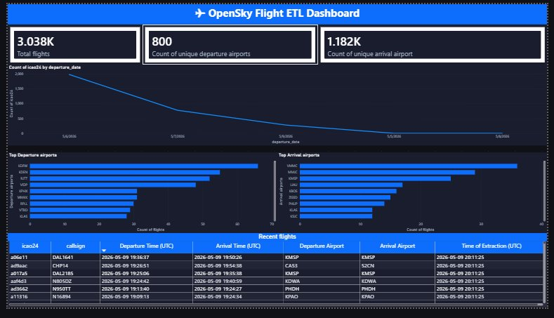

# ✈ OpenSky Flight ETL Pipeline

A fully automated ETL (Extract, Transform, Load) pipeline that collects real-world flight data from the [OpenSky Network API](https://openskynetwork.github.io/opensky-api/python.html), transforms and stores it in a local SQLite database, and visualizes it through a Power BI dashboard.

---

## Dashboard



---

## Overview

The pipeline runs on a scheduled basis every hour, fetching the last 2 hours of global flight data. Overlapping windows are handled gracefully through an upsert-merge strategy — duplicate flights are never inserted twice, and any missing fields on existing records are automatically patched with newly available data.

---

## Features

- **Automated extraction** from the OpenSky Network REST API using their official Python client
- **Scheduled runs** every hour using APScheduler — set it and forget it
- **Smart deduplication** — overlapping fetch windows are handled via upsert-merge; existing null fields get patched with new non-null values
- **Full audit trail** — every ETL run is logged to the `etl_runs` table with counts, timestamps, and error messages
- **Credential support** — authenticates with `client_id` / `client_secret` when provided, falls back to anonymous access automatically
- **Secure configuration** — credentials are loaded from environment variables via `.env`, never hardcoded
- **Power BI dashboard** — dark-themed dashboard with KPI cards, time series, airport rankings, and a live flights table

---

## Project Structure

```
opensky_etl/
├── main.py                   # Entry point — sets up logging and starts scheduler
├── config.py                 # Central config — loads env vars, all settings in one place
├── scheduler.py              # APScheduler — runs ETL immediately then every 1 hour
├── etl/
│   ├── extract.py            # Calls OpenSky API for the last 2-hour window
│   ├── transform.py          # Validates, cleans, and normalises FlightData objects
│   ├── load.py               # Upsert-merges records into SQLite
│   └── pipeline.py           # Orchestrates Extract → Transform → Load
├── db/
│   └── schema.py             # Creates flights and etl_runs tables
├── opensky_dark_theme.json   # Power BI dark theme file
├── .env.example              # Environment variable template
├── .gitignore                # Blocks .env, .db, and logs from Git
└── requirements.txt
```

---

## ETL Flow

```
OpenSky API
    │
    │  get_flights_from_interval(now - 2h, now)
    ▼
Extract (extract.py)
    │  List of FlightData objects
    ▼
Transform (transform.py)
    │  Validate, clean nulls, convert timestamps to UTC strings
    ▼
Load (load.py)
    │  INSERT ... ON CONFLICT DO UPDATE SET col = COALESCE(excluded.col, col)
    ▼
SQLite Database
    ├── flights      — one row per unique (icao24, first_seen)
    └── etl_runs     — one row per pipeline execution
```

---

## Database Schema

### `flights`
| Column | Type | Description |
|---|---|---|
| `icao24` | TEXT | ICAO 24-bit aircraft address |
| `callsign` | TEXT | Flight callsign |
| `first_seen` | INTEGER | Unix timestamp of first detection |
| `last_seen` | INTEGER | Unix timestamp of last detection |
| `first_seen_utc` | TEXT | Human-readable UTC departure time |
| `last_seen_utc` | TEXT | Human-readable UTC arrival time |
| `est_departure_airport` | TEXT | Estimated departure airport (ICAO code) |
| `est_arrival_airport` | TEXT | Estimated arrival airport (ICAO code) |
| `est_departure_airport_horiz_dist` | INTEGER | Horizontal distance to departure airport (m) |
| `est_arrival_airport_horiz_dist` | INTEGER | Horizontal distance to arrival airport (m) |
| `ingested_at` | TEXT | Timestamp when the record was first inserted |

### `etl_runs`
| Column | Type | Description |
|---|---|---|
| `run_at` | TEXT | UTC timestamp of the run |
| `window_begin` | INTEGER | Start of the fetch window (Unix epoch) |
| `window_end` | INTEGER | End of the fetch window (Unix epoch) |
| `flights_fetched` | INTEGER | Raw count returned by the API |
| `flights_inserted` | INTEGER | New rows actually inserted |
| `status` | TEXT | `success` or `error` |
| `error_message` | TEXT | Error details if status is `error` |

---

## Setup & Installation

### 1. Clone the repository
```bash
git clone https://github.com/AhmedAlaa5501/opensky-etl.git
cd opensky-etl
```

### 2. Install the OpenSky API client
The official client is not on PyPI — install directly from source:
```bash
git clone https://github.com/openskynetwork/opensky-api.git
pip install ./opensky-api
```

### 3. Install dependencies
```bash
pip install -r requirements.txt
```

### 4. Configure credentials
```bash
cp .env.example .env
```
Open `.env` and fill in your OpenSky credentials:
```
OPENSKY_CLIENT_ID=your_client_id_here
OPENSKY_CLIENT_SECRET=your_client_secret_here
```
> If you don't have credentials, leave them blank — the pipeline runs in anonymous mode automatically with reduced rate limits.

### 5. Run the pipeline
```bash
python main.py
```
The pipeline runs immediately on startup, then repeats every hour. Logs are written to both the console and `opensky_etl.log`.

---

## Power BI Dashboard

The dashboard connects directly to the SQLite database file and displays:

- **KPI Cards** — Total flights, unique departure airports, unique arrival airports
- **Flights Over Time** — Line chart of ingested flights by date
- **Top Departure Airports** — Horizontal bar chart ranked by flight count
- **Top Arrival Airports** — Horizontal bar chart ranked by flight count
- **Recent Flights Table** — Live view of the latest records in the DB
- **ETL Run History** — Audit log of every pipeline execution

### Applying the dark theme
1. Open Power BI Desktop and load your `.pbix` file
2. Go to **View → Themes → Browse for themes**
3. Select `opensky_dark_theme.json`

### Refreshing data
Click **Refresh** in the Power BI top ribbon to reload the latest data from SQLite.

---

## Configuration

All settings are in `config.py`:

| Setting | Default | Description |
|---|---|---|
| `FETCH_WINDOW_SECONDS` | `7200` | Size of each API fetch window (max 7200 = 2h) |
| `SCHEDULE_INTERVAL_HOURS` | `1` | How often the ETL runs |
| `DB_PATH` | `opensky_etl/db/flights.db` | SQLite database file path |
| `LOG_LEVEL` | `INFO` | Logging verbosity |

---

## Tech Stack

| Layer | Technology |
|---|---|
| Language | Python 3.11+ |
| API Client | opensky-api (official) |
| Database | SQLite via `sqlite3` |
| Scheduler | APScheduler 3.10 |
| Config & Secrets | python-dotenv |
| Visualization | Power BI Desktop |

